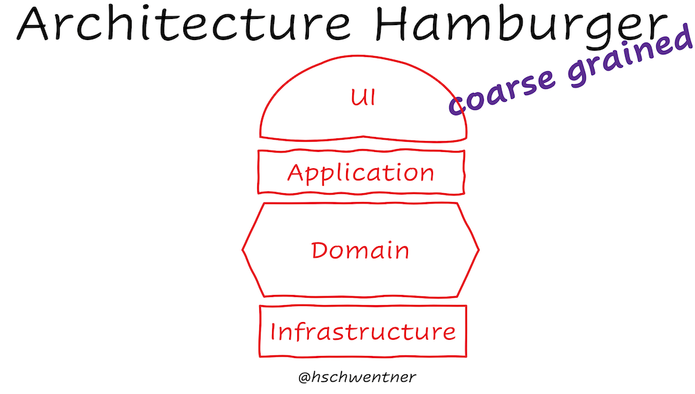

These are the notes I took during the sessions. Some of them don't have a clear structure, but are individual, unconnected ideas.

<!--more-->

## The Architecture Hamburger 

An introduction into the history of architectures. There are at least two ways of representing architectures - layers and rings.

Layers are good at representing separation of concerns (e.g. Presentation, Application, Model, Infrastructure), order of responsibility and abstraction, Control flow.   The linear nature of layers is also good for representing the [Input-Processing-Output Model](https://en.wikipedia.org/wiki/IPO_model). 

Ring representations like the [Hexagonal Architecture](https://en.wikipedia.org/wiki/Hexagonal_architecture_(software)) or [Onion Architecture](https://marcoatschaefer.medium.com/onion-architecture-explained-building-maintainable-software-54996ff8e464) allow for a good representation of *dependencies* - which layer is allowed to talk to other layers. 

At first sight, the Architecture Hamburger looks like a layer representation, but since there is no "top-down" or "bottom-up" hierarchy, it's a synthesis of both layer and ring representation.  Its direction-less representation  also allows technology mapping - the different parts of the hamburger correspond to different technologies.

[Link to the SpeakerDeck presentation of The Architecture Hamburger](https://speakerdeck.com/hschwentner/software-architecture)

## IDE plugins for DDD
This was a presentation of two plugins (one for VS Code, one for IDEs from JetBrains) that allow for metadata definition of your domain language. The IDE will then recognize the "words" of your language as part of classes, methods, variable names, comments, etc. and help you with refactoring, auto-completion and context-specific help ("intellisense for the domain"). These plugins are also helpful when you split concepts of your domain - a mass rename refactoring is not possible. Instead, the plugins will use a spellcheck/code-inspection-like visual hint (e.g. squiggly underline) that allows a code action to choose the correct new concept and do a local refactoring.

Both plugins are still in development and one of them will be commercial, geared towards enterprise customers. But the general idea -  supporting your development with domain metadata, doing name matching between domain language and code artifacts and offering domain-related refactorings and information where code matches, is out there and I'm sure I will see more plugins like these in the future.

I learned that JetBrains does not support the [Language Server protocol](https://en.wikipedia.org/wiki/Language_Server_Protocol) as good as other IDEs and editors. 

This session also introduced me to the practice of "sense making refactoring at the start of a story". 

## Introduction to Systems Thinking

- The motion in  a solar system is dynamic and non-deterministic, because the forces of each planet affect each other ([N-body problem](https://en.wikipedia.org/wiki/N-body_problem)). But you can get a good approximation of the  motions by "brute-forcing" - splitting the motions into individual 2-body simulations. Unit tests are mechanical, deterministic, so they can’t cover a whole software system, which is dynamic and non-deterministic as well. But they are still a useful approximation of describing the system.
- Software is complex, in the hand of the user it becomes complicated because users are non-deterministic.
- Systems thinking could be some kind of “meta-law“ of the universe. You can find the same patterns in biology, cybernetics and sociology.
- Ask "What’s the useful boundary to draw?", to avoid pulling the whole universe into your system? All systems are interrelated, a Russian doll of systems. Systems have environments, systems inside systems. It's good to have empathy. “I might do the same thing if I was stuck in that system."
- Systems are rarely fully closed.
- Resilience, self-organization and hierarchy are properties of successful, long-lived systems. Resilience comes from feedback loops. *Lean* is stable, but fragile. Subtle interactions between resilience, performance and stability. Trade offs. E.g. global supply chain
- Book recommendation: [The Systems Bible, John Gall ](https://en.wikipedia.org/wiki/Systemantics)

## The "job to be done" interview 
This was about product development: People "hire" products to do a job, so for market research you could  use job interview techniques to make customers "interview" the product after they have hired it.

A customer "hires" a product, if it promises a better desired outcome or a better way of achieving the same outcome.

Do the interview as soon as the customers have bought the product, so they have a good recollection of circumstances.

Use a "[Customer forces canvas](https://blog.leanstack.com/the-customer-forces-canvas-updated/)" to map the forces of "push" (what problem drove customers towards your product), "pull" (what features were attractive), "inertia" (what anxieties held them back before hiring the product) and "friction" (unpleasant experiences after hiring the product). For a product to be hired, push and pull has to be greater than inertia and friction.

Book recommendation: [Running Lean, Ash Mauruya](https://leanstack.com/books/runninglean)

